# Creating an Office Scheduler with Amazon Lex and Twilio
## Introduction
This Lab will walk you through how you can use [Amazon Lex](https://aws.amazon.com/lex/) with [Twilio](https://www.twilio.com/) to create an office scheduler. Appointments will be facilitated with the afformentioned services and stored in DynamoDB.

From a high level the operation of the application is shown below.  
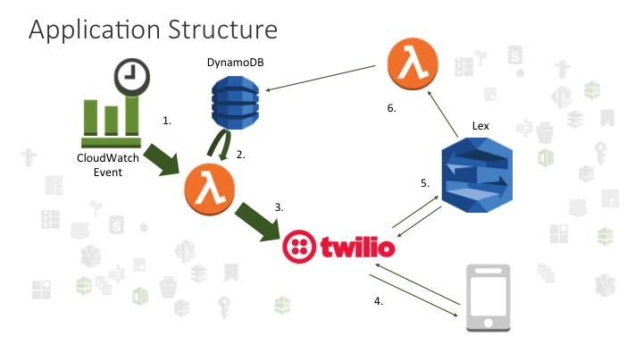 
1. A Cloudwatch cron style job triggers a lambda function each day. 
2. The Lambda function checks if there are any existing bookings in DynamoDB that are 180 days old.
3. If a customer is found to have not had a booking for 180 days, Lambda sends an SMS request to Twilio
4. Twilio sends out an SMS to the customer reminding them they have not come in for 6 months
5. The customer replies to Twilio which facilitates communication with Lex. Lex elicits required details from the customer to make a bookings. 
6. Once Lex has the required details to make a booking, it triggers a Lambda function which inputs the booking into DynamoDB. 

Note some of the app is built by CloudFormation and some is build by you:
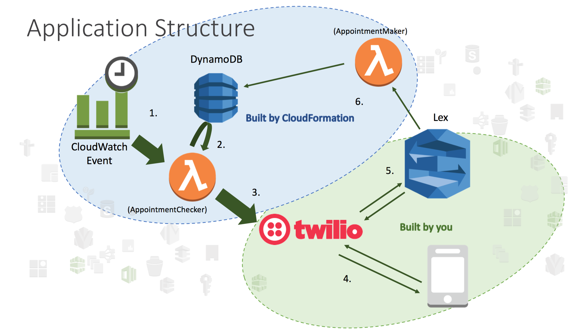

## Instructions
1. Login to AWS console with the credentials provided for you. 
1. Navigate to the Cloudformation section of the console, by typing Cloudformation in “Find Services" 
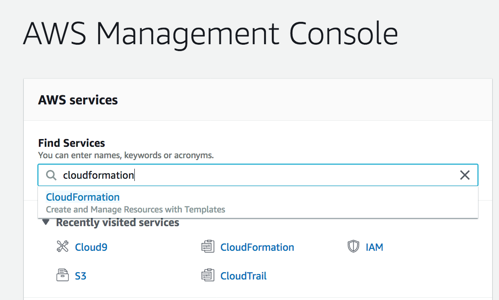

1. Click Create Stack. On the next page select radio button "Specify an Amazon S3 template URL". In the textbox input:
https://s3.amazonaws.com/eawhite-syd-summit2019/Appointment_scheduler1.yaml 
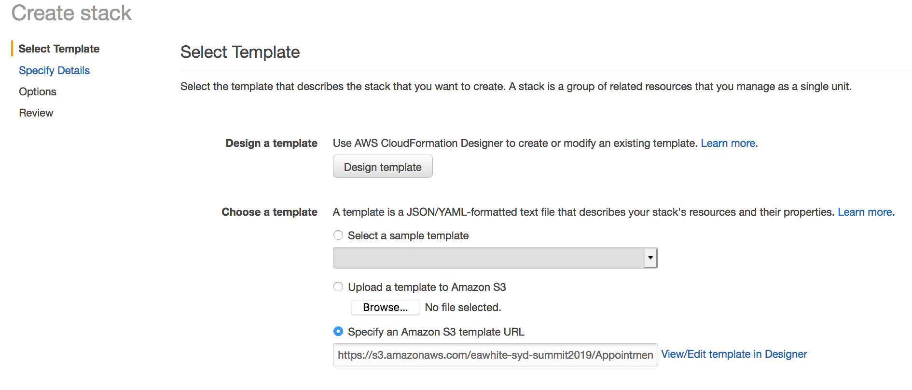 

1. Check that your CloudFormation stack built out successfully. You should see CREATE_COMPLETE in the Status column of your stacks.
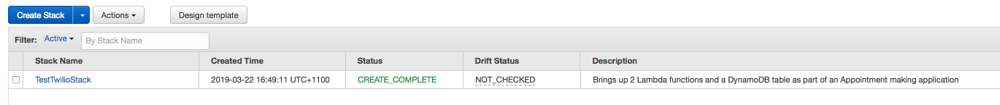 

1. You now need to design how your Lex bot will converse with your users. Navigate to the Lex console
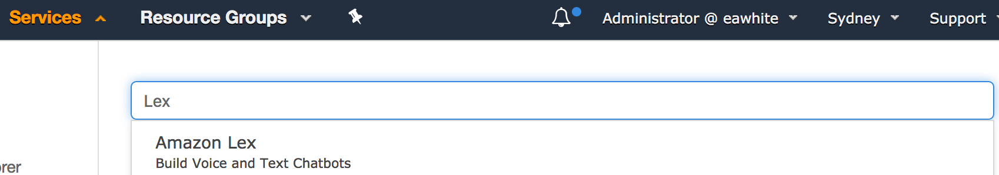 

1. Hit Create to create a new Lex bot
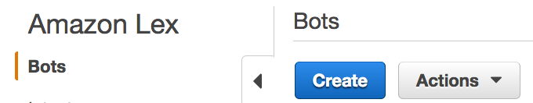 

1. You will then want to create a custom Lex bot with the following settings.
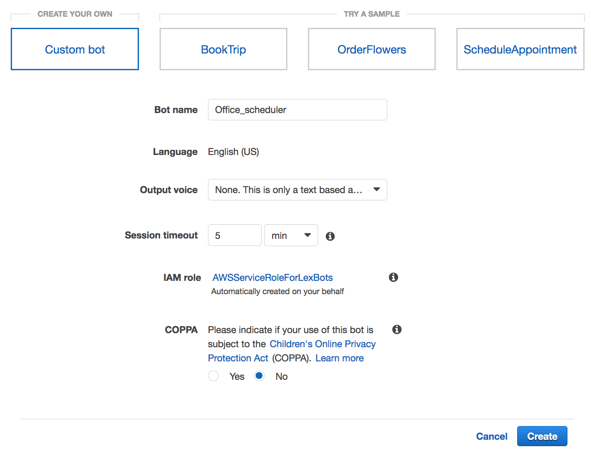 

1. Click "Create Intent", this will give your bot a motive.
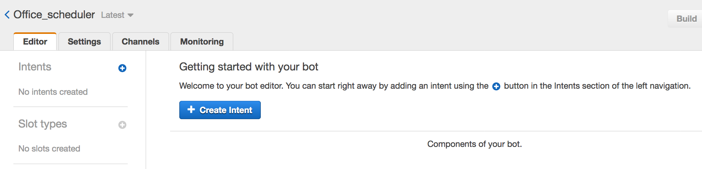 

1. Give your intent a name.
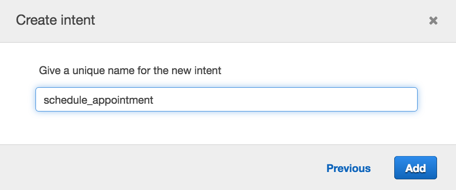 

1. Input some phrases that will trigger this intent, eg.
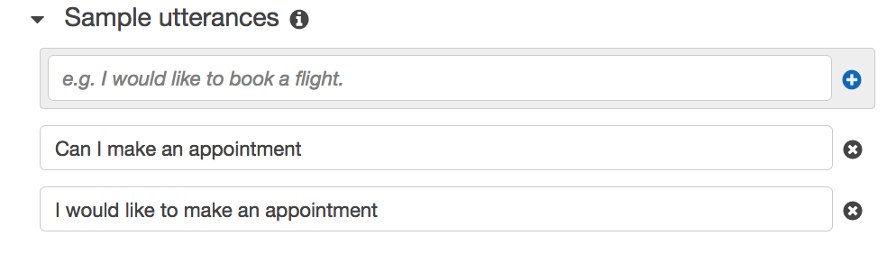 

1. Note that "time" and "date" slots are part of amazons default slot types. There is one slot type we are using that is not an Amazon default slot type ie "doctor".
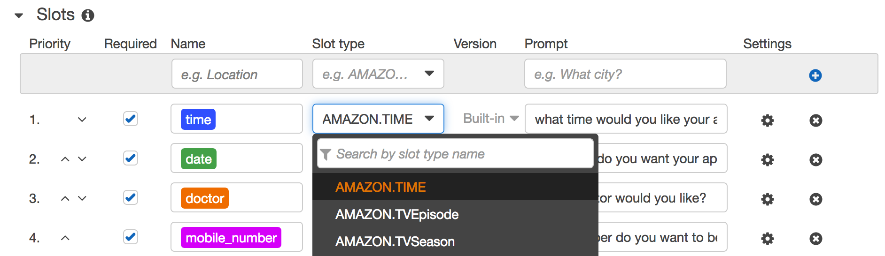 
Before you create all the slot types you will need to create this slot type by hitting "+" next to "Slot types". 
 
Select "Create new slot type". You will then see the below screen, create the new doctor slot with however many doctor names you want by clicking the "+" button each time.
When you have added all doctors, hit "Add slot to intent".
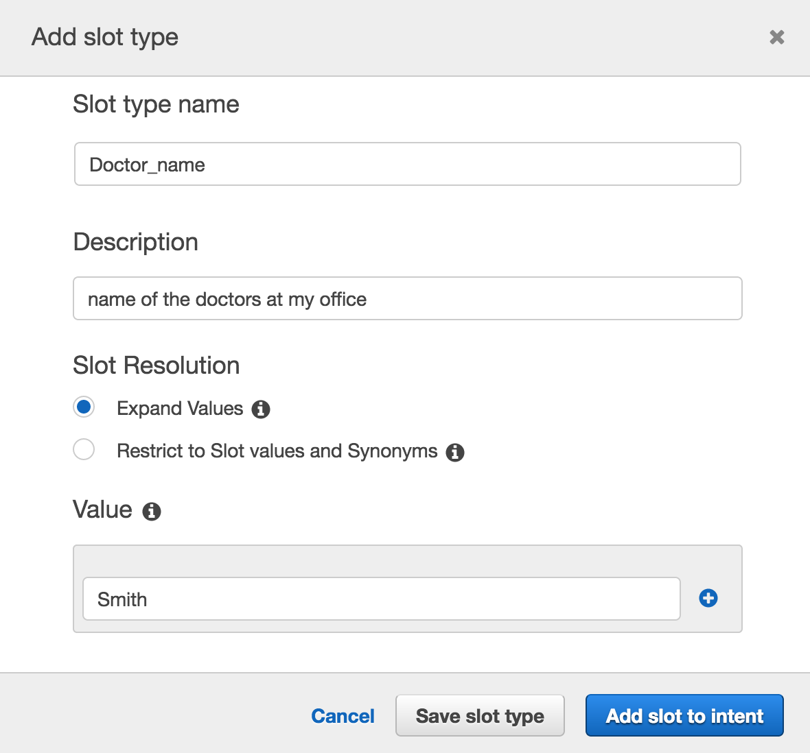 

1. You can now create all your slots. Check the "required" check box for each slot. Use the following diagram as a guide.
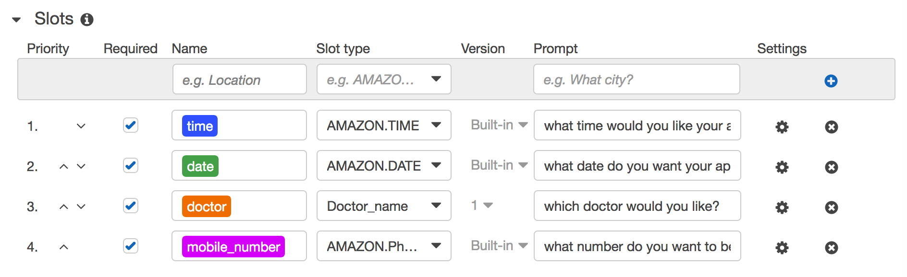 
The "time" slot was created with the slot type AMAZON.TIME, you will find relevant slot types for each of the other slots, the "doctor" slot being the only slot that you created a custom value for. Note the default value for the newly created Doctor_name slot_type is "slotOne", you will need to update this to "doctor".

1. Put in a "one shot" utterance. This will enable users who are familiar with your bot to fill all "slots" in one utterance. You will see the slots, or minimum amount of info to fill the intent are "date", "time" and "doctor". (there will infact be one more, phone number that will need to be elicited from the user individually)
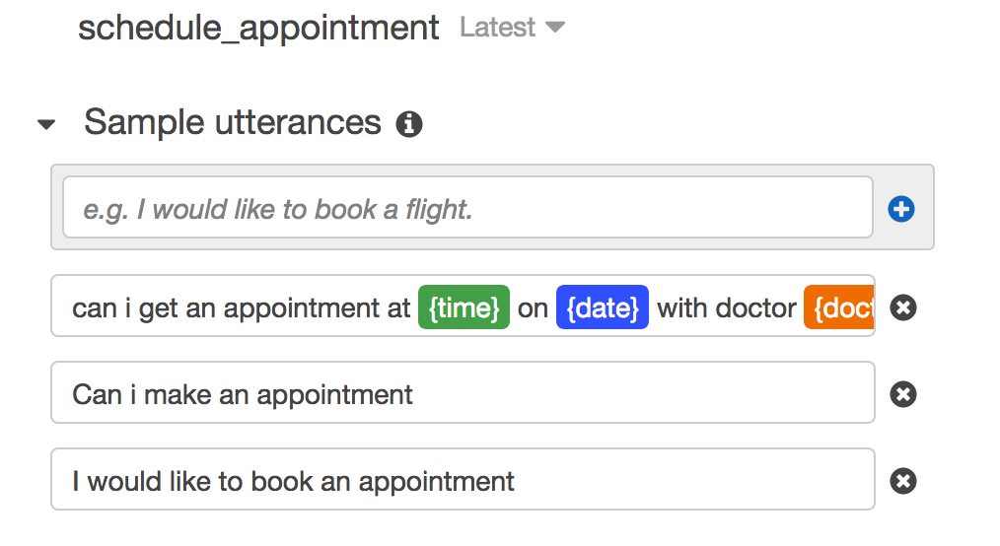 

1. At this stage we can test the bots interactions. Hit "Build" and see if there are any errors that need correcting.  
If the build is successful, test the conversation of your bot.
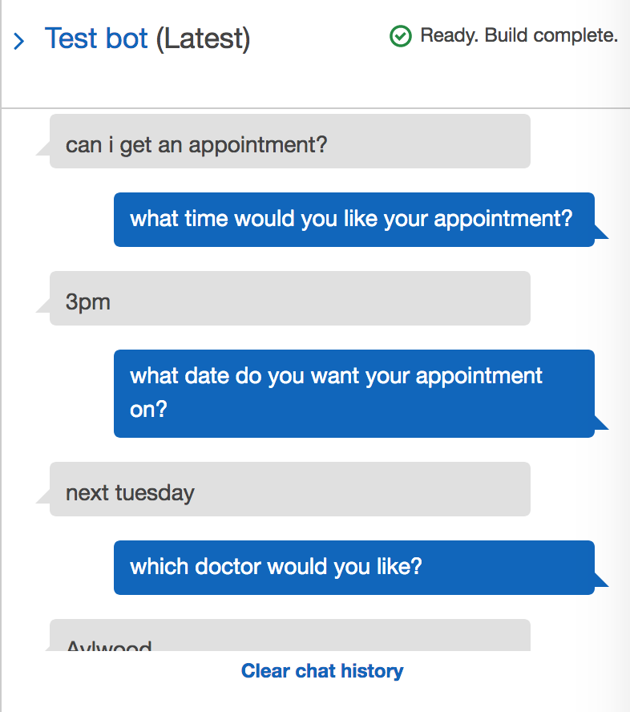 

1. Fill in the "Confirmation prompt" and the "Fulfilment". For the "Confirmation" prompt you will want to fill in something like "Ok confirming you want to see Doctor {doctor} at {time} on {date}. And your contact phone number is {mobile_number}, correct?" as this will confirm with the user the slots are filled in correctly.
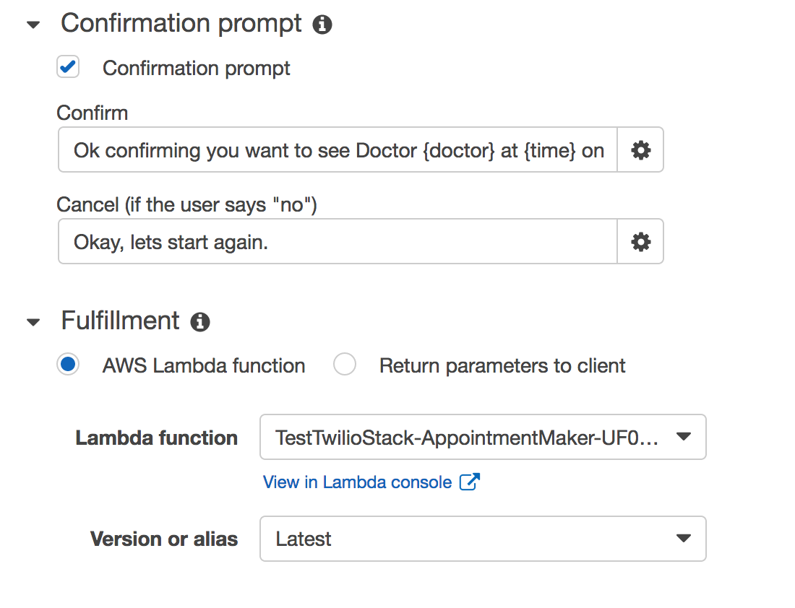 
Under "Fulfilment" select the lambda function that has been created for you, it will begin with your CloudFormation stack name and have "AppointmentMaker" in its name.

1. Save and Build your bot and test the bots conversation as previously done with a dummy booking. As a final step Lex will receive a prompt back from Lambda saying that is has made the booking, it will be of the format "OK you are booked in to see Dr {doctor} at {time} on {date}". You can confirm that your dummy booking has gone into DynamoDB by navigating to "DynamoDB" in the console
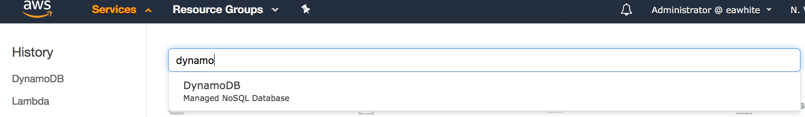 
Select "Tables" on the laft hand side, select the table that begins with your Cloudformation stack name, and select the "Items" tab, you should see the dummy entry you created when testing you Lex bot.
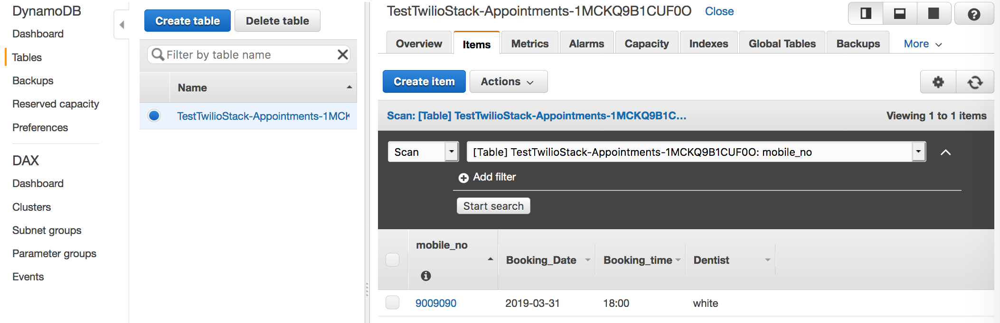 
If you can see your dummy booking in DynamoDB and you got the confirmation from Lambda, you can select "Publish" in Lex console.
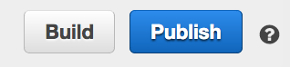 
You will need to give the published version an alias, and select "Publish".
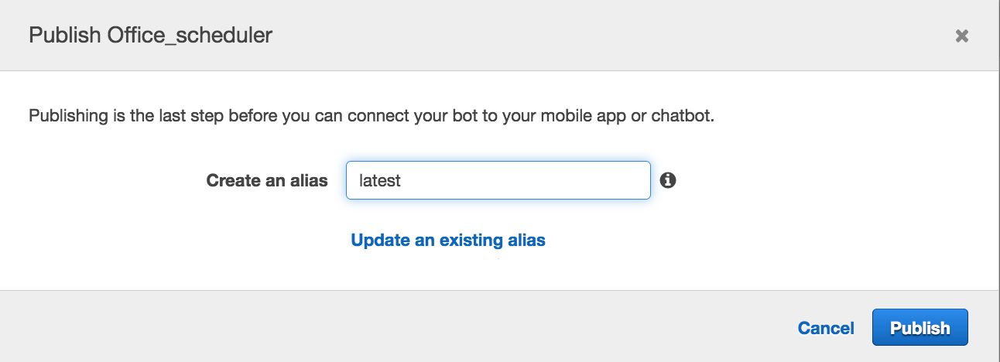 

1. You will now need to connect Lex to Twilio, in the Lex console select the tab "Channels", and select "Twilio SMS".
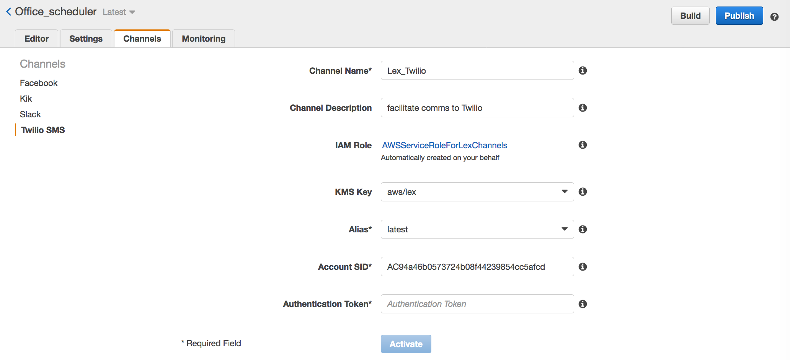 
Fill in the settings and hit "Activate".

  The Account SID and Authentication code come from our pre-created Twilio Account. Go to https://www.twilio.com and login with email "eawhite@amazon.com" and Password: "AWSTestAccount". Once logged in, expand out the "Project Info" field and you will see the "Account SID" and "Authentication Token" to copy over.
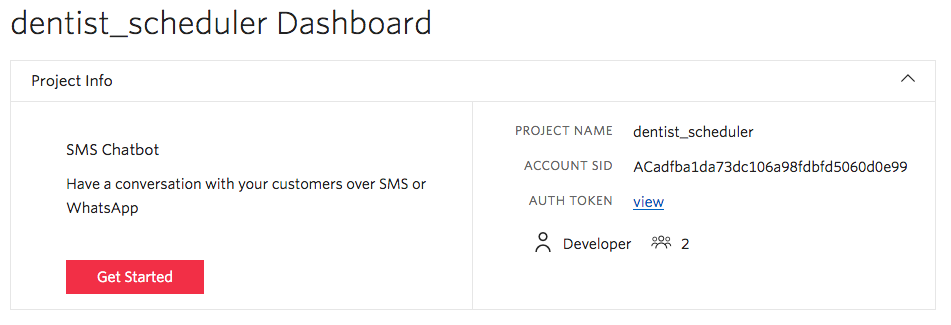 

1. Lex will then give you a "Callback URL", copy the URL and go back to the Twilio account.

1. Navigate to phone numbers and select a phone number.
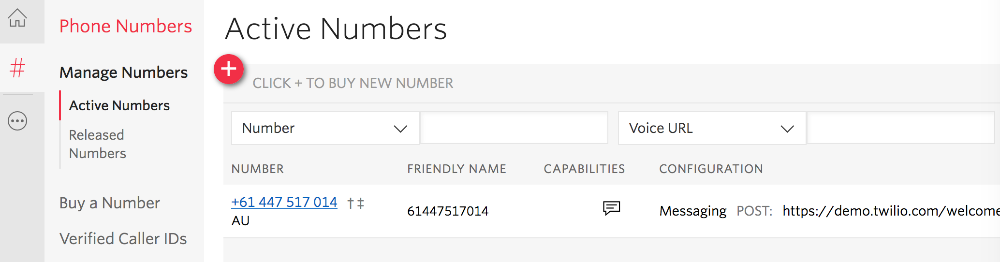 

1. Check this number is not in use by another attendee by checking the "Events log", if there has been no activity on the number for 15 minutes, it is good to use! If unsure double check with one of the facilitators, we can purchase a new number if necessary.
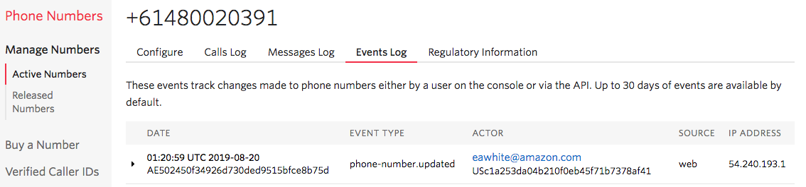 

1. Back under the "Configure" tab, in the "Messaging" section, paste your Lex Callback URL into the "Webhook" URL.
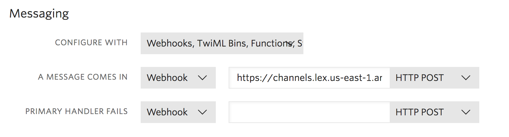 

1. You will also need to verify your mobile number in Twilio so Twilio can send you SMS messages. This is under "Verified Caller IDs". Add your number here and follow the SMS verification step.
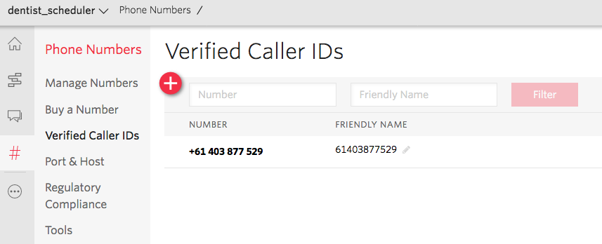 

1. Your app is now complete. To test your app end-to-end you will need to put an entry into DynamoDB that is exactly 100 days old and "Test" the Lambda function "AppointmentChecker". This is because the AppointmentChecker function checks for any appointments 100 days old to contact them. To find the date 100 days ago, go to lambda in the console and look for a function that starts with "{Cloudformation stack name}-100DayChecker-" and "Test" the function. 
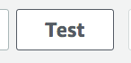 

1. You will need to name the test something.
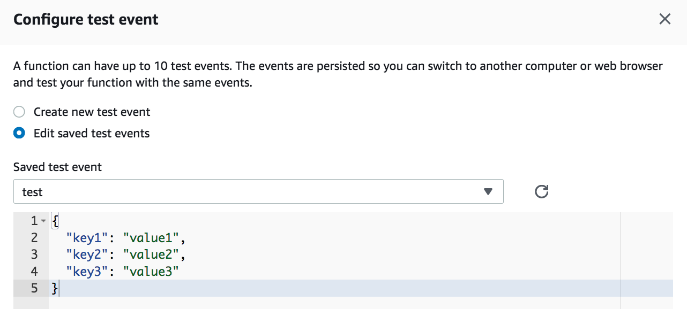 
run the test, the date should appear in the execution results.
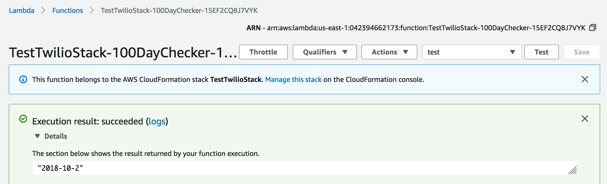 

1. The easiest way to get a booking 100 days old into DynamoDB is to use Lex, as there is currently nothing stopping us from putting in bookings in the past. Make a booking with your Twilio validation phone number as your contact number. Use +61 format.
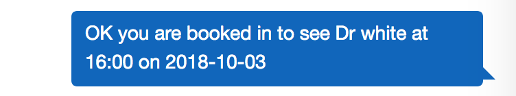 

1. Check your phone number made it into DynamoDB
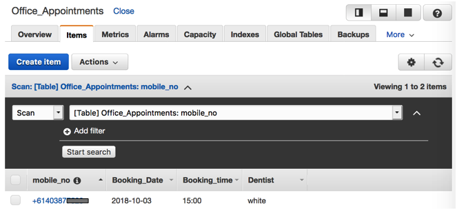 
And run your AppointmentChecker lambda function by setting up a "Test", as before no extra inputs are required, you only need to name your unit test.
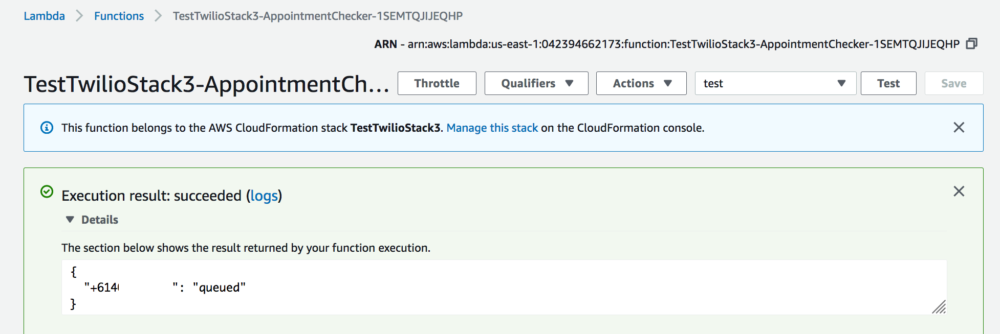 
You should see the output above, indicating that an SMS has been sent by Twilio to your mobile number. You should receive an SMS from your bot and be able to make a new booking and see it appear in DynamoDB.
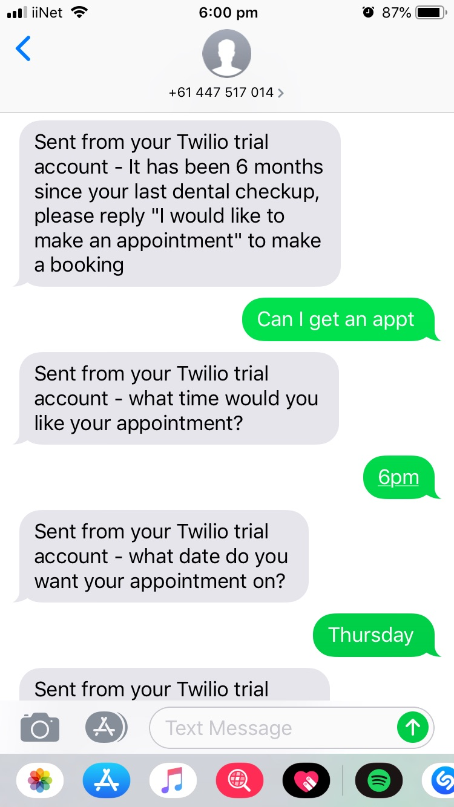 

1. You can try this with other phone numbers, just ensure you verify the numbers in Twilio first.
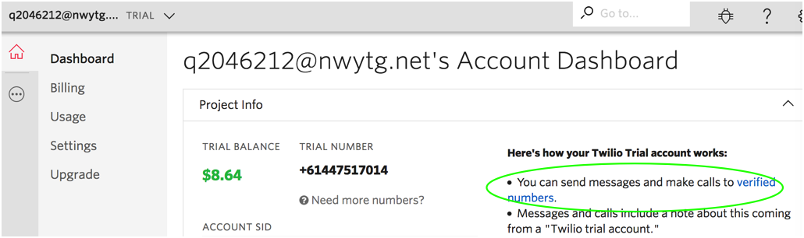 

1. Extra activity - if you want your bot to sound more human, you can vary the re-prompts it does if it is having trouble eliciting a prompt from the user.
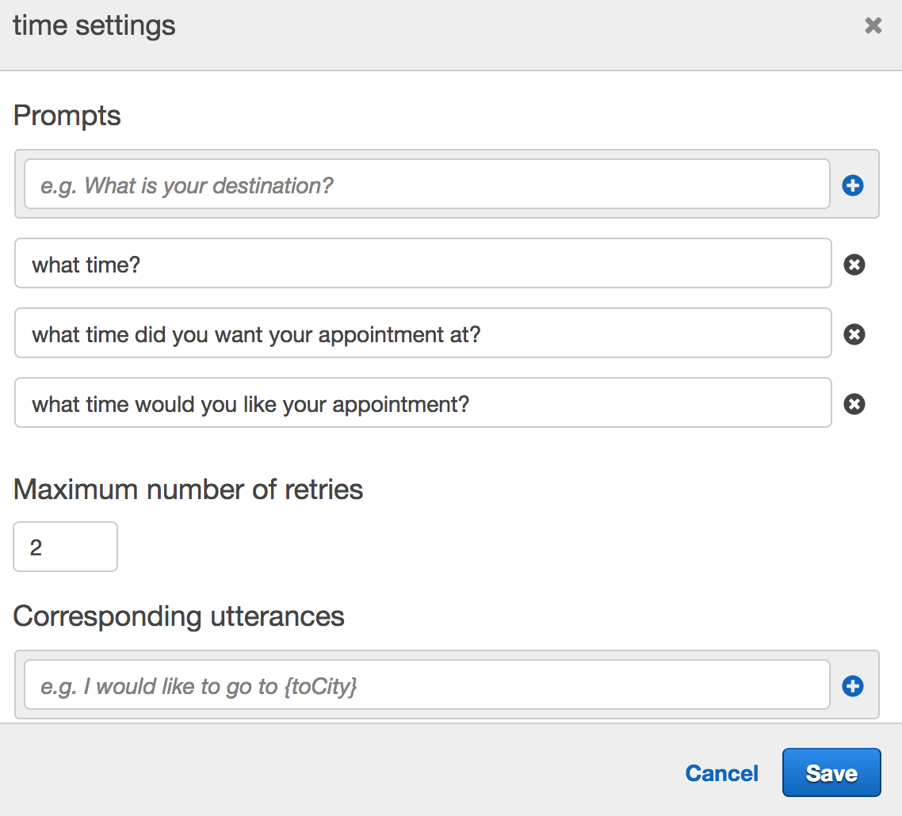 

1. Once you are done exploring the functionality of your appointment scheduler, you can delete your cloudformation stack (note this will delete your Lex bot too).
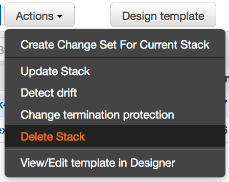 
